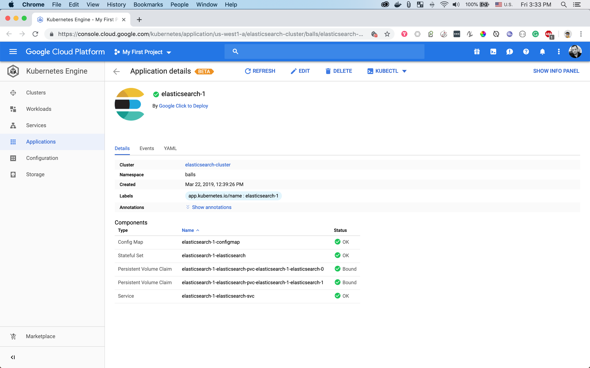

# go_flavio

#### X-Team Challenge to Build an App in Go and Vue
> **Start Time:** Tuesday, 19 Mar 2019 @ 11:05 AM (MST)

---

## Elasticsearch instance
> Elasticsearch instance deployed on an Ubuntu 18.04 webserver

> The Ubuntu web server uses Nginx as a reverse proxy inside of a Docker Container.

> The Docker container is deployed inside of a Kubernetes cluster on Google Cloud



---

## Go websocket with html client

> The server echoes messages sent to it and returns to client.

Run WebSocket example locally.
```bash {.copy-clip}
go run server.go
```
Open http://localhost:7001 in the Chrome, Firefox or Safari and follow the instructions on the page.

--- 

TODO:
- [ ] : ssl certificates

    ```bash {.copy-clip}
    certbot --nginx -d escanner.co
    ```
